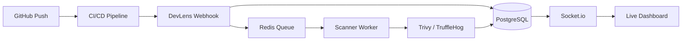

# 🛡️ DevLens — Unified Developer Platform

> **Build with Confidence. Deploy with Security. Monitor in Real-time.**

DevLens is a comprehensive dashboard designed to unify code movements, security postures, and deployment pipelines into a single, beautiful interface.

---

## 📖 Essential Documentation

Neeche diye gaye link par click karke project ki detailed working samajhein:
👉 **[PROJECT_OVERVIEW.md](./PROJECT_OVERVIEW.md)** (What, Why, and How explained)

---

## 🏗️ System Architecture



## 🚀 Quick Start

### Prerequisites
- **Docker Desktop** (Required for DB & Redis)
- **Node.js 20+**
- **npm 10+**

### 1. Zero to Hero Setup
```bash
# Start Infrastructure
docker-compose up -d

# Install Dependencies
npm install

# Setup Database
cd apps/backend
npx prisma db push
npx ts-node prisma/seed.ts
```

### 2. Launching the Platform
```bash
# Terminal 1 — Backend (Port 4000)
cd apps/backend && npm run dev

# Terminal 2 — Frontend (Port 3000)
cd apps/frontend && npm run dev
```

---

## 🛠️ Tech Stack

| Layer | Technology |
|---|---|
| **Frontend** | Next.js 15, TailwindCSS, Socket.io-client, Recharts |
| **Backend** | Express 5, TypeScript, Socket.io, BullMQ |
| **Data** | Prisma ORM, PostgreSQL 16, Redis 7 |
| **Security** | Aqua Security Trivy, TruffleHog |

---

## 📡 API Hub

| Method | Endpoint | Description |
|---|---|---|
| `POST` | `/api/webhooks/pipeline` | Entry point for deployments |
| `GET` | `/api/dashboard/overview` | Platform health & stats |
| `GET` | `/api/vulnerabilities` | Security scan results |
| `GET` | `/api/devflow/repos` | Connected repositories |

---

## 🗺️ Roadmap

- [x] **Phase 1**: Core Live Dashboard & Mock Pipelines
- [x] **Phase 2**: Real-time Trivy & TruffleHog Integration
- [ ] **Phase 3**: Slack/Email Alerts & Managed Cloud Deployment
