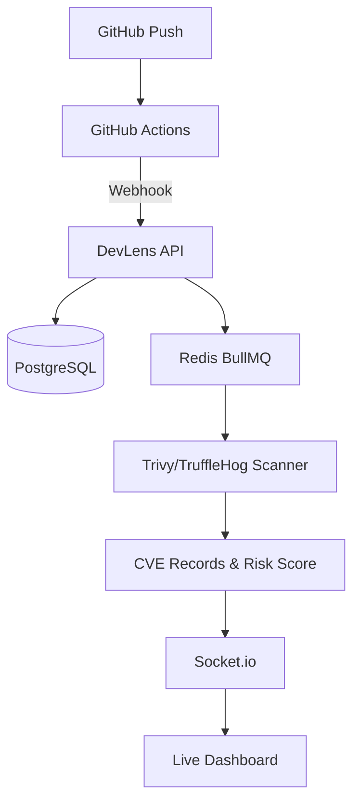

# 🛡️ DevLens — Unified Developer Platform

[](https://www.typescriptlang.org/)
[](https://nextjs.org/)
[](https://www.prisma.io/)
[](https://redis.io/)
[](https://devlens-demo.vercel.app/)
[](https://github.com/yuvrajgohil24/DevLens/actions/workflows/devlens-ci.yml)

> **Build with Confidence. Deploy with Security. Monitor in Real-time.**


## ✨ Overview

DevLens is a comprehensive developer platform designed to bridge the gap between development and security. It provides real-time visibility into your deployment pipeline, automated security scanning (SCA/SAST), and proactive risk management—all in a single, intuitive dashboard.

---

## ❓ Why DevLens?

In modern DevOps, security is often an afterthought or buried in complex logs. **DevLens** changes that by making security "visible" and "actionable":

-   **Stop "Flying Blind"**: Get instant visual confirmation of every push and its security posture.
-   **Security at Speed**: Don't wait for weekly reports. See vulnerabilities the moment they hit your pipeline.
-   **Consolidated Intelligence**: No more jumping between GitHub, Trivy CLI, and monitoring tools. Everything is in one place.
-   **Developer-First**: Built with a clean, high-performance UI that developers actually enjoy using.

---

## 📸 Dashboard Previews

| **Live Dashboard** | **Deployments** | **Vulnerability Analysis** |
|:---:|:---:|:---:|
|  |  |  |

| **Services Monitor** | **Git Flow (DevFlow)** | **Policy Violations** |
|:---:|:---:|:---:|
|  |  |  |

---

## 🎬 Demo

> **Local setup requires PostgreSQL 16 + Redis 7.** For a zero-config preview, use the Docker Compose route below.

### 🐳 One-Command Setup (No Local DB/Redis Required)
```bash
docker-compose up
# Frontend → http://localhost:3000  |  Backend → http://localhost:4000
```
Docker Compose boots the full stack with a pre-seeded database. No PostgreSQL or Redis configuration required.

---

## 🌟 Key Features

-   **🚀 Live Pipeline Tracking**: Real-time visualization of GitHub Actions workflows via Webhooks.
-   **🔍 Automated Security Scanning**: Integrated **Aqua Security Trivy** and **TruffleHog** for vulnerability and secret detection.
-   **📊 Smart Risk Scoring**: Dynamic CVE analysis and risk categorization (Low, Medium, High, Critical).
-   **⚡ Real-time Updates**: Powered by **Socket.io** for instant dashboard notifications without refreshes.
-   **🔔 Proactive Alerts**: Automated **Slack** notifications for critical security findings — fires on every scan completion.

---

## 🏗️ Architecture



---

## 🛠️ Tech Stack

| Layer | Technology |
|---|---|
| **Frontend** | Next.js 15, TailwindCSS, Socket.io-client, Recharts |
| **Backend** | Express 5, TypeScript, Socket.io, BullMQ |
| **Data** | Prisma ORM, PostgreSQL 16, Redis 7 |
| **Security** | Aqua Security Trivy, TruffleHog |

---

## 🚀 Quick Start

### Prerequisites
- **Node.js 20+**
- **npm 10+**
- **PostgreSQL 16**
- **Redis (Windows/Linux)**

### 1. Setup & Installation
```bash
# Clone the repository
git clone https://github.com/yuvrajgohil24/DevLens.git
cd DevLens

# Install dependencies, push schema, and seed data
npm run setup
```

### 2. Launching the Platform
```bash
# Start both Backend & Frontend concurrently
npm run dev
```

### 3. Running Tests
```bash
cd apps/backend
npm test
# 12 unit tests, zero infrastructure required (no DB / Redis)
```

---


## 📡 API Hub

| Method | Endpoint | Description |
|---|---|---|
| `POST` | `/api/webhooks/pipeline` | Entry point for deployments |
| `GET` | `/api/dashboard/overview` | Platform health & stats |
| `GET` | `/api/vulnerabilities` | Security scan results |
| `GET` | `/api/devflow/repos` | Connected repositories |

---

## 🗺️ Roadmap

- [x] **Phase 1**: Core Live Dashboard & Mock Pipelines
- [x] **Phase 2**: Real-time Trivy, TruffleHog & Snyk Integration + Slack Alerts + Basic Test Suite
- [ ] **Phase 3**: Authentication (Clerk), Cloud Deployment (Railway/Render) & Email Notifications
- [ ] **Phase 4**: Managed Infrastructure (Kubernetes / Helm Charts)
